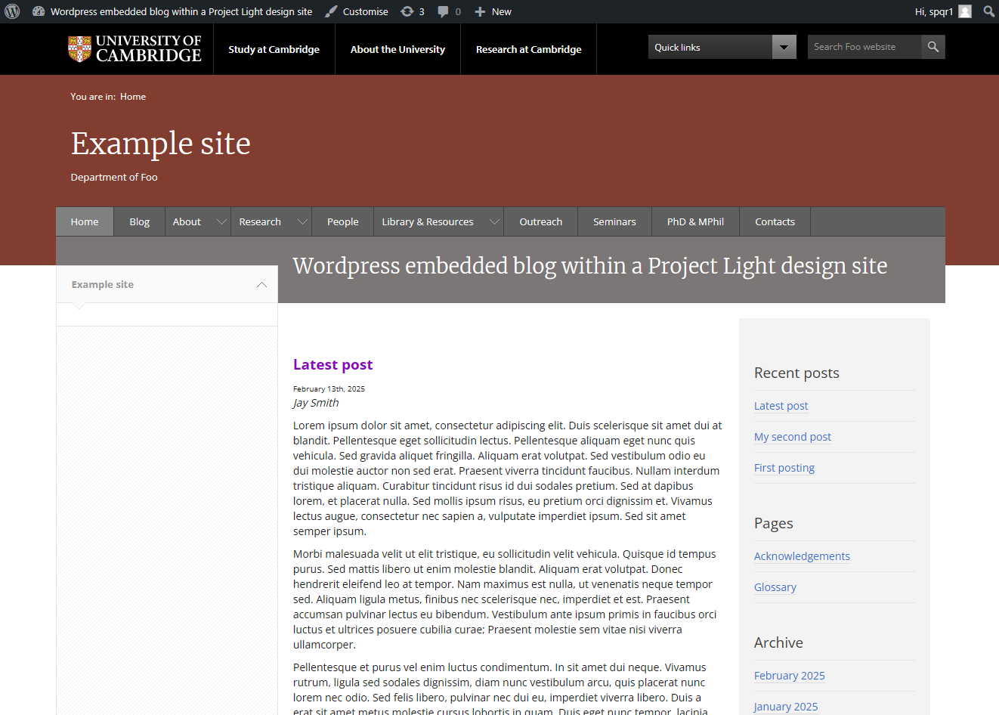

Wordpress Project Light embedded theme
======================================

This is a Wordpress theme to embed a simple blog within a Project Light design site.

Screenshot
----------

Usage
-----

Standard theme install details.

Author
------

Martin Lucas-Smith, Department of Geography, University of Cambridge, 2014-25.

License
-------

GPL3.

Code originally branched from the basic Kubrick theme, and heavily cut-down.
